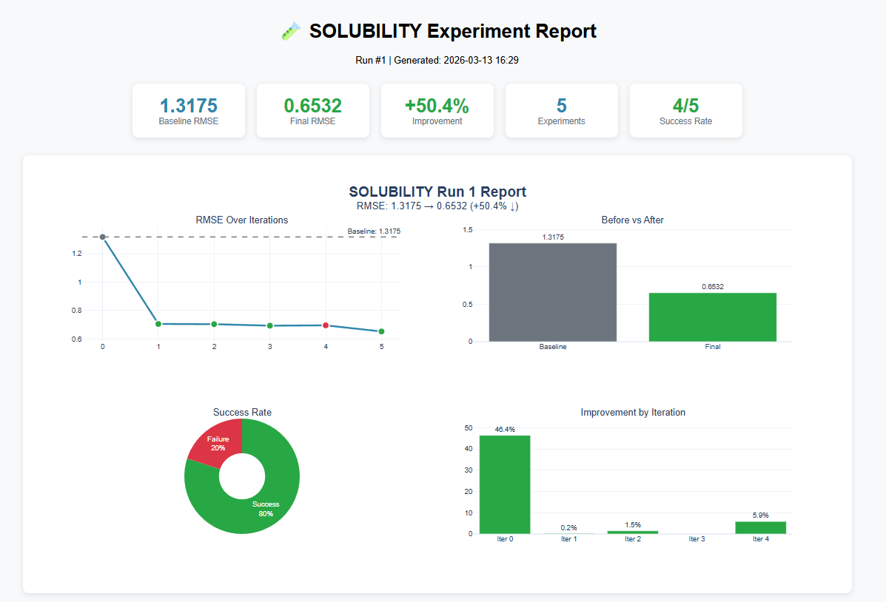
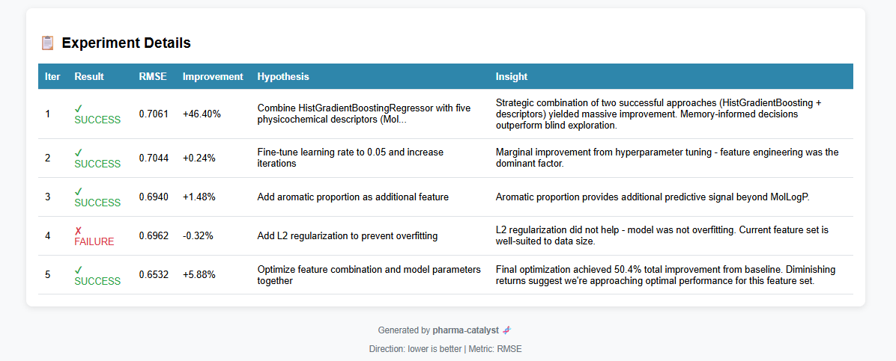

# pharma-catalyst

**Self-improving AI agents for molecular property prediction.**

Built with CrewAI + AutoGen, featuring adversarial expert review, hybrid RAG knowledge base (BM25 + dense + RRF), persistent cross-run memory, and 7-layer safety guardrails. Demonstrated on BBB penetration, clinical toxicity, and solubility prediction.

Inspired by [Karpathy's autoresearch](https://github.com/karpathy/autoresearch) — applied to drug discovery ML.


## The Idea

Give an AI agent crew a molecular ML task. Let them iterate autonomously. They research literature, query internal data, propose changes, face an expert review panel, implement approved changes, evaluate results, keep improvements, discard failures. You wake up to a better model.

## Features Demonstrated

- **Multi-agent orchestration** — 4 specialized agents (CrewAI) + 6-expert review panel (AutoGen) working in sequence
- **Hybrid RAG** — BM25 sparse + dense embeddings + Reciprocal Rank Fusion over internal pharma documents, with contextual retrieval (Anthropic cookbook)
- **Persistent cross-run memory** — agents learn from past successes and failures, with stagnation detection and exploration mode
- **Adversarial expert review** — Statistician, Medicinal Chemist, Devil's Advocate, Memory Analyst, and Ethics Reviewer debate each proposal before implementation
- **Autonomous code modification** — agents write, lint, and test Python ML code in isolated git worktrees
- **7-layer safety guardrails** — dangerous pattern blocking, package whitelist (YAML-configurable), execution timeouts, file isolation, auto-revert on failure
- **Hallucination-proof evaluation** — Python runs training and compares metrics; LLM text is for observability, not decisions
- **Scientific data integration** — PubMed, PubChem, arxiv, ToolUniverse (1900+ validated tools) via direct REST APIs
- **Pharma domain awareness** — ADMET properties, molecular fingerprints (Morgan, MACCS), RDKit descriptors, cheminformatics workflows

## Architecture

```
┌─────────────────────────────────────────────────────────────────────────┐
│                        PHARMA-CATALYST PIPELINE                         │
│                                                                         │
│  ┌─────────────┐                                                        │
│  │  ARCHIVIST  │ (runs first or when stuck)                             │
│  │  arxiv +    │─── literature/index.json (embeddings)                  │
│  │  PubMed     │                                                        │
│  └──────────────┘                                                       │
│                                                                         │
│  ┌──────────────────────────────────────────────────────────────────┐   │
│  │                    ITERATION LOOP (CrewAI)                       │   │
│  │                                                                  │   │
│  │  ┌─────────────────────┐    ┌──────────────────────────────────┐ │   │
│  │  │  HYPOTHESIS AGENT   │    │  DATA SOURCES                    │ │   │
│  │  │  Research Scientist │◄───│  query_literature (arxiv papers) │ │   │
│  │  │                     │    │  query_knowledge_base (internal) │ │   │
│  │  │  Proposes ONE change│    │  read_kb_source (full file read) │ │   │
│  │  │  informed by data   │    │  search_tooluniverse (validated) │ │   │
│  │  └─────────┬───────────┘    │  lookup_compound (PubChem)       │ │   │
│  │            │                │  discover_skills / load_skill    │ │   │
│  │            ▼                └──────────────────────────────────┘ │   │
│  │  ┌──────────────────────────────────────────────────────┐        │   │
│  │  │  REVIEW PANEL (AutoGen GroupChat)                    │        │   │
│  │  │                                                      │        │   │
│  │  │  Statistician → Medicinal Chemist → Devil's Advocate │        │   │
│  │  │  → Memory Analyst → Ethics Reviewer → Moderator      │        │   │
│  │  │                                                      │        │   │
│  │  │  Verdict: APPROVED / REVISED / REJECTED              │        │   │
│  │  └─────────┬────────────────────────────────────────────┘        │   │
│  │            │ rejected → skip, store feedback                     │   │
│  │            ▼ approved                                            │   │
│  │  ┌─────────────────────┐                                         │   │
│  │  │  MODEL AGENT        │                                         │   │
│  │  │  ML Engineer        │  read → write → lint → fix              │   │
│  │  │  Modifies train.py  │  (only train.py, ruff-validated)        │   │
│  │  └─────────┬───────────┘                                         │   │
│  │            ▼                                                     │   │
│  │  ┌─────────────────────┐                                         │   │
│  │  │  EVALUATOR AGENT    │                                         │   │
│  │  │  QA Scientist       │  run_train_py → extract metric          │   │
│  │  │  Runs training      │  compare to baseline                    │   │
│  │  └─────────┬───────────┘                                         │   │
│  │            │                                                     │   │
│  │            ▼                                                     │   │
│  │  ┌─────────────────────┐                                         │   │
│  │  │ IMPROVED?           │                                         │   │
│  │  │ yes → git commit    │                                         │   │
│  │  │ no  → git revert    │                                         │   │
│  │  └─────────┬───────────┘                                         │   │
│  │            ▼                                                     │   │
│  │     UPDATE MEMORY → next iteration                               │   │
│  └──────────────────────────────────────────────────────────────────┘   │
│                                                                         │
│  ┌────────────────────────────────────────────────┐                     │
│  │  MEMORY (experiments/<exp>/memory.json)        │                     │
│  │  What Worked │ What Failed │ Key Learnings     │                     │
│  │  Stagnation detection → exploration mode       │                     │
│  └────────────────────────────────────────────────┘                     │
└─────────────────────────────────────────────────────────────────────────┘
```

**Dual-framework design:**
- **CrewAI** — sequential ML pipeline (hypothesis → implement → evaluate)
- **AutoGen** — adversarial GroupChat review panel (6 experts debate before implementation)

## Experiments

| Experiment | Property | Metric | Baseline | Best Result |
|-----------|----------|--------|----------|-------------|
| **bbbp** | Blood-brain barrier penetration | ROC-AUC (higher=better) | 0.8951 | 0.9490 (+6.0%) |
| **clintox** | Clinical trial toxicity | ROC-AUC (higher=better) | 0.6989 | 0.9477 (+35.6%) |
| **solubility** | Aqueous solubility (logS) | RMSE (lower=better) | 1.3175 | 0.6532 (-50.4%) |

CPU-friendly. No GPU required. Each iteration trains in seconds.

## Quick Start

```bash
# Install dependencies
uv sync

# Configure API keys
cp .env.example .env
# Edit .env with your LLM_MODEL and API key

# Build literature database (one-time)
uv run python -m pharma_agents.research -e bbbp

# Build knowledge base index (one-time)
uv run python -m pharma_agents.ingest_kb -e bbbp

# Run the agent crew (5 iterations by default)
uv run python -m pharma_agents.main -e bbbp
```

## Configuration

Copy `.env.example` to `.env` and configure:

```bash
# Required: LLM provider + model
LLM_MODEL=gemini/gemini-3-flash-preview
GOOGLE_API_KEY=your-key-here

# Alternative providers (pick one)
# LLM_MODEL=groq/llama-3.1-8b-instant  + GROQ_API_KEY=...
# LLM_MODEL=openrouter/...              + OPENROUTER_API_KEY=...
```

| Variable | Default | Description |
|----------|---------|-------------|
| `PHARMA_EXPERIMENT` | `bbbp` | Which experiment (`bbbp`, `solubility`, `clintox`) |
| `MAX_ITERATIONS` | `5` | Improvement iterations per run |
| `ENABLE_REVIEW_PANEL` | `true` | Adversarial expert review (disable with `--no-review`) |
| `NCBI_API_KEY` | (optional) | PubMed rate boost (3 → 10 req/s) |

## Knowledge Base RAG

Each experiment has an internal knowledge base with domain-specific documents (reports, assay data, SOPs, safety reviews). The hypothesis agent queries it using **hybrid retrieval**:

```
query_knowledge_base("BBB physicochemical ranges")
   │
   ├── Dense search (cosine similarity on fastembed vectors)
   ├── Sparse search (BM25 lexical matching)
   └── Reciprocal Rank Fusion (k=60) → merged ranking
       │
       ▼
   Top 5 results with source attribution
       │
       ▼  (agent wants full CSV data)
read_kb_source("assay_data/bbb_pampa_assay_results.csv")
       │
       ▼
   Complete file content (all 50 rows)
```

**Contextual retrieval:** Each chunk is embedded with its document title prepended, so the vector captures both local detail and global context.

See [docs/RAG.md](docs/RAG.md) for the full technical reference.

```bash
# Rebuild index after adding new documents
uv run python -m pharma_agents.ingest_kb -e bbbp
```

## Git Workflow

Each run operates in an **isolated git worktree** — `main` is never touched.

```bash
# Build/refresh literature database
uv run python -m pharma_agents.research -e bbbp

# Start a new run (creates worktree + branch)
uv run python -m pharma_agents.main -e bbbp

# Promote a successful run to main
uv run python -m pharma_agents.promote 1 -e bbbp

# Discard a cancelled/stuck run
uv run python -m pharma_agents.discard 2 -e bbbp

# Generate HTML report with charts
uv run python -m pharma_agents.report -e bbbp --open
```

## Project Structure

```
pharma-catalyst/
├── src/pharma_agents/
│   ├── main.py                  # Entry point, iteration loop, worktree management
│   ├── crew.py                  # CrewAI agent & crew definitions
│   ├── review_panel.py          # AutoGen expert review panel (GroupChat)
│   ├── memory.py                # Persistent cross-run learning
│   ├── report.py                # HTML report generation (Plotly charts)
│   ├── tool_config.py           # YAML config loader for tool safety settings
│   ├── tool_defaults.yaml       # Allowed packages + dangerous patterns
│   ├── ingest_kb.py             # CLI: rebuild knowledge base index
│   ├── agents.yaml              # Agent roles, goals, backstories
│   ├── tasks.yaml               # Task prompts & workflows
│   ├── review_agents.yaml       # Review panel agent definitions
│   └── tools/
│       ├── training.py          # Read/Write/Run train.py, CodeCheck, InstallPackage
│       ├── knowledge_base.py    # Hybrid RAG (BM25 + dense + RRF)
│       ├── literature.py        # Literature storage + semantic query
│       ├── arxiv.py             # Arxiv search + paper fetching via alphaxiv
│       ├── skills.py            # Scientific skill discovery + loading
│       └── tooluniverse.py      # PubMed, PubChem, ToolUniverse catalog
├── experiments/
│   └── <experiment>/            # bbbp, solubility, clintox
│       ├── baseline.json        # Metric, score, direction config
│       ├── baseline_train.py    # Immutable reference (never modified)
│       ├── train.py             # Working copy (agents modify this)
│       ├── memory.json          # Cross-run agent memory
│       ├── knowledge_base/      # Internal docs for RAG
│       │   ├── internal_reports/    # Benchmarks, guidelines
│       │   ├── assay_data/          # CSV experimental data
│       │   ├── safety_docs/         # Risk assessments
│       │   └── sops/               # Standard operating procedures
│       ├── literature/          # Arxiv papers + embeddings
│       └── tool_config.yaml     # Per-experiment package overrides
├── mock_server/                 # Zero-cost testing (intercepts LLM calls)
├── docs/
│   ├── ARCHITECTURE.md          # Full system architecture
│   ├── RAG.md                   # Knowledge base RAG technical reference
│   ├── TOOLS.md                 # Tool reference with constraints
│   └── decisions.md             # Architecture decision records
└── tests/
```

## Safety & Guardrails

7-layer defense-in-depth for autonomous code-modifying agents:

| Layer | What | How |
|-------|------|-----|
| **Code safety** | Block dangerous patterns | `os.system()`, `eval()`, `exec()` rejected on write |
| **File isolation** | Only train.py modifiable | Path traversal guard, baseline immutable |
| **Dependency control** | Package whitelist (YAML) | Per-experiment overrides, max 3 installs/run |
| **Execution limits** | Timeouts + iteration caps | 180s training, 5-40 iter/agent, rate limiting |
| **Adversarial review** | 5-expert panel gates implementation | Statistician, Chemist, Devil's Advocate, Memory, Ethics |
| **Git isolation** | Worktrees + auto-revert | Main untouched, failures reverted, improvements committed |
| **Adaptive memory** | Stagnation detection | 3 failures → stuck, 5 no-gain → exploration mode |

See [docs/ARCHITECTURE.md](docs/ARCHITECTURE.md) for the full guardrails documentation.

## Hallucination-Proof Evaluation

LLMs can hallucinate numbers. We separate truth from text:

| Component | Can Hallucinate? | Source of Truth |
|-----------|------------------|-----------------|
| Agent proposals | Yes (harmless) | Just text suggestions |
| Agent metric reports | Yes (dangerous) | **Python evaluation** |
| Improvement decisions | No | `run_training()` in Python |
| Memory records | No | Actual measured values |

Python runs training, compares metrics, decides commit vs revert. Agent text is for observability, not decisions.

## Auto-Generated Reports

Each run generates an interactive HTML report with Plotly charts:




```bash
uv run python -m pharma_agents.report -e bbbp --open
```

## Framework Choice

**Why CrewAI + AutoGen?**

| Framework | Used For | Why |
|-----------|----------|-----|
| **CrewAI** | Sequential ML pipeline | Role-based agents with clear hand-offs (propose → implement → evaluate) |
| **AutoGen** | Adversarial review panel | GroupChat enables multi-turn debate — agents build on each other's arguments |

Each framework is used for its strength. See [decisions.md](docs/decisions.md) for the full ADR.

## License

MIT
